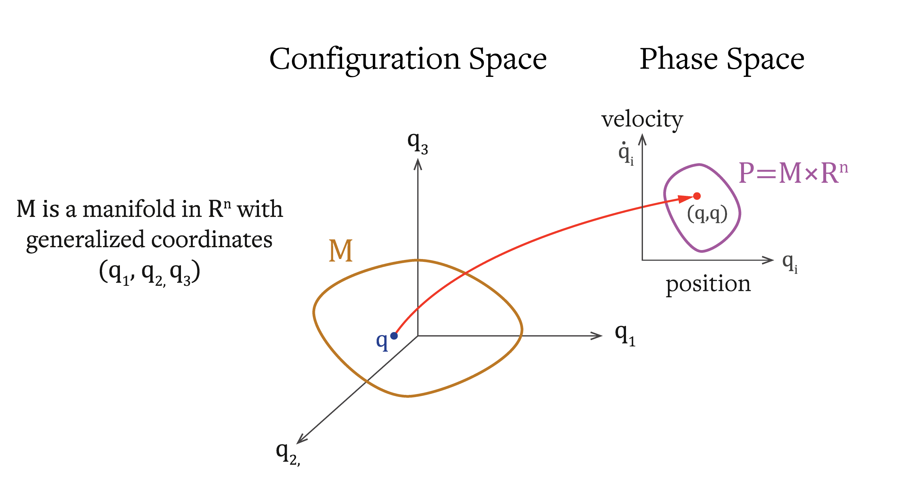

# Reasoning diagnostics

A phase-space (Hamiltonian) lens on LLM multi-hop reasoning.

## The idea

Reasoning chains are mapped into an embedding phase space. Each chain gets a
Hamiltonian "energy" that balances:

- **kinetic energy** — reasoning *progression*, and
- **potential energy** — *question relevance*.

*From configuration space (model parameters) to phase space — where a Hamiltonian lives.*

## The finding

Valid reasoning chains show **lower and more stable** Hamiltonian energy than
invalid chains. Trajectory curvature and conservation-like quantities
discriminate valid from invalid reasoning. This gives a usable **diagnostic**
signal for reasoning quality.

!!! warning "Stated caveat (from the paper)"
    The claimed ability to *steer* or *improve* reasoning is **metaphorical**
    and not empirically established. The connection between physical systems
    and reasoning is an analogy. The solid contribution is the diagnostic
    geometric patterns — not a causal control mechanism.

## Artifacts

- `studies/reasoning-geometry/Hamiltonian_final_version.ipynb`
- `studies/reasoning-geometry/AdvancedSymplecticOptimizer_v2.ipynb`

Dataset: OpenBookQA (Mihaylov et al., 2018).

## Paper

Marín, J. (2024). *Geometric Analysis of Reasoning Trajectories: A Phase Space
Approach to Understanding Valid and Invalid Multi-Hop Reasoning in LLMs.*
arXiv:[2410.04415](https://arxiv.org/abs/2410.04415).

This diagnostics thread informs
[Groundlens](https://github.com/groundlens-dev/groundlens).
